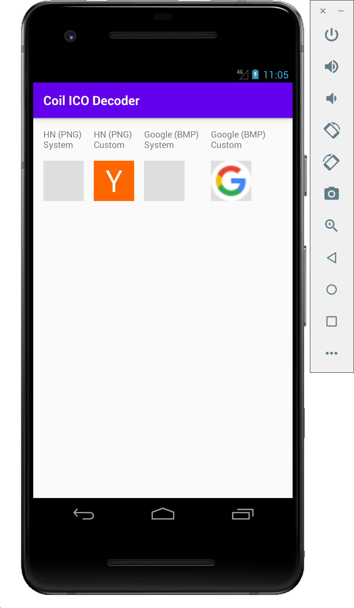
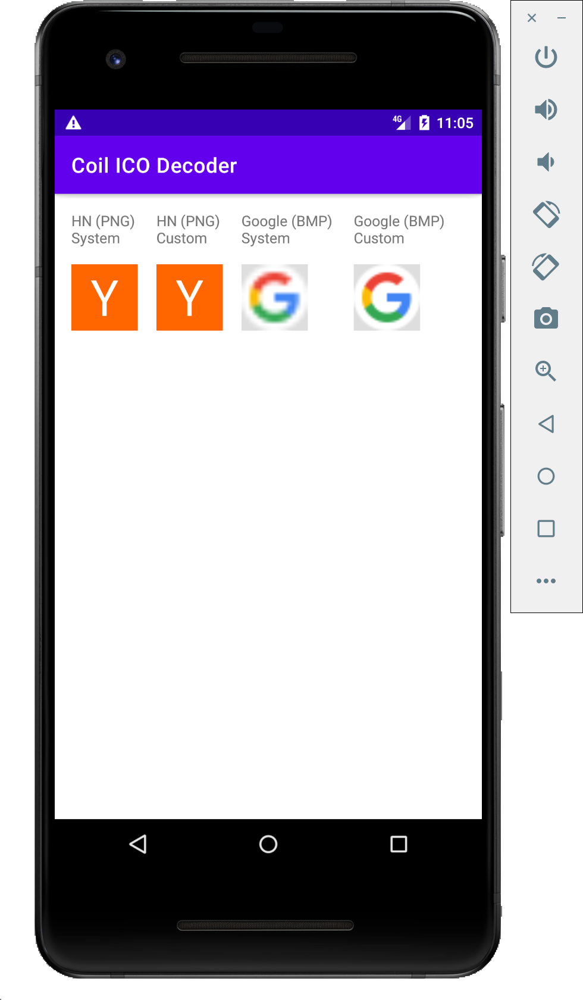

# coil-ico

A simple ICO decoder for [Coil](https://github.com/coil-kt/coil).

Provides ICO decoding for Android versions where it is not available (< API 21), and improves it for versions where it is. Android 5.0+ supports ICO decoding, but will only choose the first image in the file which may not be the desired one.

|API 16|API 21|
|---|---|
|||
